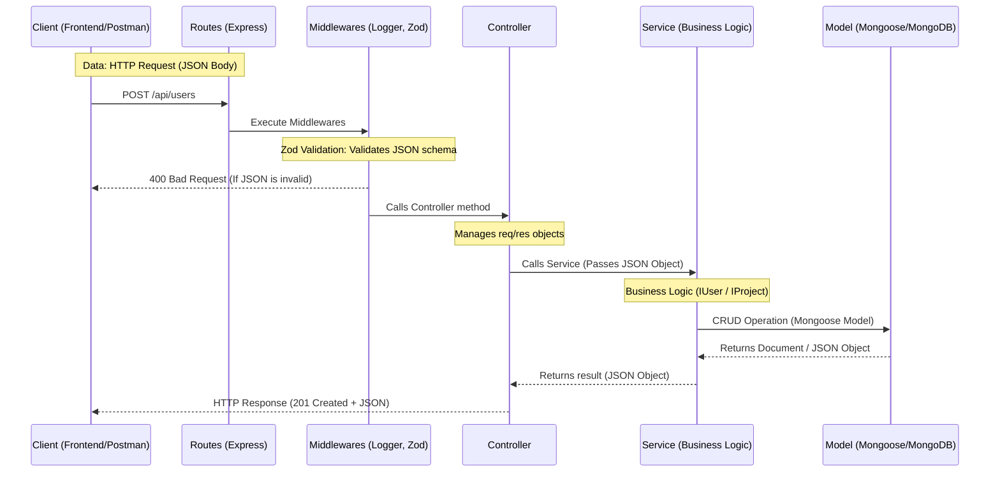

# EA REST API with Express & TypeScript

This project is a professional REST API developed for the Application Engineering (EA) course. It implements a modern stack focused on type safety and a clean layered architecture.

## Data Flow and Sequence Diagram

The following diagram illustrates how a request travels through the system, from the HTTP entry point to database persistence, highlighting the data transformation at each stage.



## 🛠 Tecnologías Utilizadas

- [Node.js & Express]: Server-side runtime and web framework.
- [TypeScript]: High-level programming language that adds static typing to JavaScript.
- [Mongoose]: Object Data Modeling (ODM) library for MongoDB.
- [Zod]: TypeScript-first schema declaration and validation library.
- [Pino]: Structured logging library.
- [CORS]: Middleware to enable cross-origin resource sharing.

## Project Structure

The project follows a layered architecture to improve maintainability and scalability:

```
├── src
│   ├── routes
│   ├── middlewares
│   ├── controllers
│   ├── services
│   ├── models
│   ├── database.ts
│   ├── config.ts       # Configuracion de la API Rest
│   └── app.ts          # Punto de entrada de la aplicación
├── package.json        # Configuración de las dependencias y scripts
├── tsconfig.json       # Configuración de TypeScript
├── .gitignore
├── LICENSE
└── README.md
```

## Setup 

Install all dependencies

```
npm install
```

Run in development mode

```
npm run dev
```

Build and run in production

```
npm run build
npm start
```
